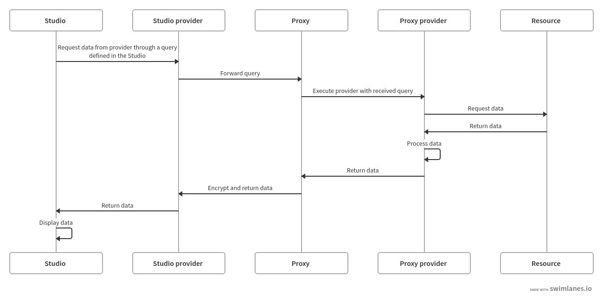

# Proxy

The proxy application allows executing Providers outside of the Studio. This
can be useful in situation where direct access from the Studio to a resource is
not available. It does require that the Proxy has access to the resource in
question.

Unlike a HTTP proxy, this Proxy server won't simply forward requests. Rather, it
will invoke a Provider, that will fetch the actual data.

## Quickstart

```shell
cargo install --locked fpd
fpd pull --all
${EDITOR} "$(fpd config paths data-sources)"
```

## Installation

### With cargo

Once the crate is published on crates.io, you will be able to do

```shell
cargo install --locked fpd
```

Otherwise, with a cloned version of the repository

```shell
cargo install --path .
```

### Kubernetes

TODO: Insert section on how to run the proxy server on Kubernetes.

## Setup

### Finding configuration directories

To know where the Fiberplane Daemon is looking for its configuration
file (`data_sources.yaml`) and its providers, you can use

```shell
fpd config paths
```

This is where you should put your providers and `data_sources.yaml`
(the exact value depends on the platform).

### Download pre-built providers

To download all first-party (Fiberplane) providers, you can use
```shell
fpd pull --all
```

Check `fpd pull --help` to see the supported providers if you want to pull only
some of them.

## Run

### Usage with Tilt

When running the Proxy with Tilt, you can use the `PROVIDERS` environment
variable to control which Providers will be configured by Tilt.

For example: `$ PROVIDERS=prometheus,sentry tilt up`

For some Providers, Tilt may also configure and start additional services to
fetch data from.

**Warning:** If you do not specify which Providers to run, *all* Providers will
run. This may be convenient, but especially the Elasticsearch provider will use
a *lot* of memory on your system.

## Overview

The following diagram shows the interaction between the Studio, Proxy, and their
Providers ([source](https://swimlanes.io/#bZFBEoMgDEX3nCIX8AJOp6u26449AQOxMtOCDaBy+zJqqaA74L//kxDG2MN5qQxUZ1hPPZlBSaQaGvx4tA4kdxxaMu+kgevI+GcHHCJCASS2SqMEpaOEa1QKT7ZY5U5mCjXcDI2c5GJnbH5N8qaH64TCO/xHjMp1QChQDVjYt2UatMaTwHyKEjxVGeg86YU7SCw7i3eB1mZ8zCuxLLX8jx8f59SCQu+Aaxmn21siebCfPZf2WMNF2f7Fw6x/AQ==)):


